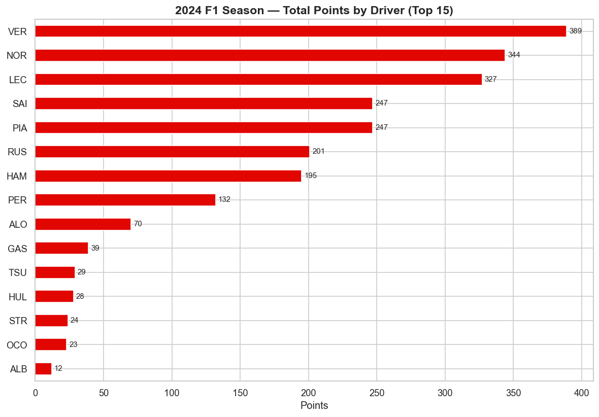
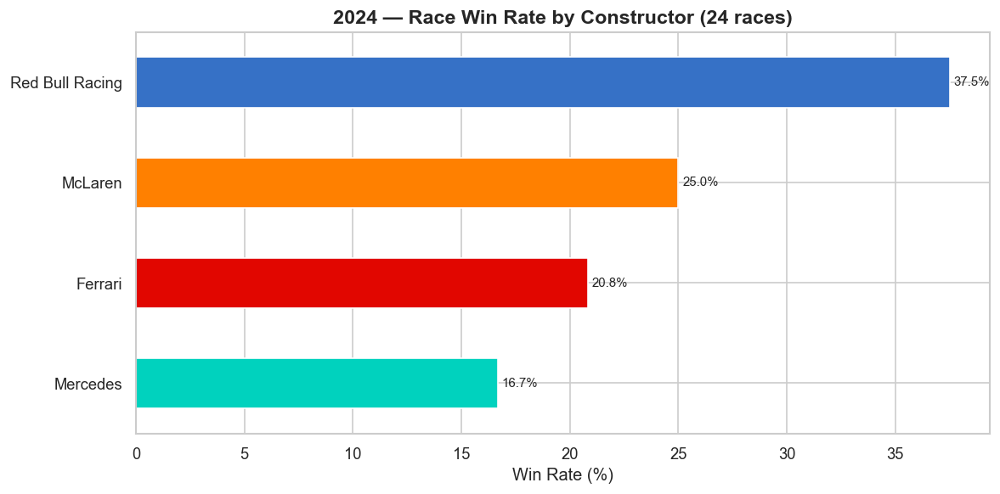

# F1 Race Winner Predictor

A machine learning project to predict Formula 1 race winners using race results, qualifying performance, and historical patterns. Built as a portfolio project for the 2024 season, with a planned Streamlit dashboard for live predictions.

## Project Status

**In active development** — currently in the data exploration phase.

- Data pipeline: 2024 season race results loaded via `fastf1` (479 rows, 24 races, 24 drivers)
- Exploratory data analysis on driver, constructor, and grid position patterns
- Feature engineering (qualifying, recent form, circuit characteristics)
- Model training (logistic regression baseline → XGBoost)
- Streamlit dashboard for race-by-race predictions

## Key Findings (2024 Season EDA)



- **Verstappen won the championship** with 399 points, ahead of Norris (344) and Leclerc (327)
- **Four constructors took race wins**: Red Bull (9), McLaren (6), Ferrari (5), Mercedes (4)
- **Grid position vs finish position correlation:  0.736** — strong signal that qualifying performance is a meaningful predictor, but with enough variance that a model has room to add value beyond just "predict the pole-sitter wins"



These findings inform the feature set: any model needs to capture both **driver/team strength** (long-term performance) and **race-specific factors** (grid position, qualifying time, circuit type) to outperform a "pole-sitter wins" baseline.

## Tech Stack

- **Python 3.9+**
- **Data:** `fastf1` (primary), Jolpica API (historical fallback), OpenF1 (live data)
- **Analysis:** `pandas`, `numpy`, `matplotlib`, `seaborn`
- **Modelling:** `scikit-learn`, `XGBoost` (planned)
- **Deployment:** Streamlit (planned)

## Setup

```bash
git clone https://github.com/Om-Ravindra-Patil/f1-race-predictor.git
cd f1-race-predictor
python3 -m venv venv
source venv/bin/activate
pip install -r requirements.txt
```

## Usage

Load the 2024 season data:

```bash
python3 src/load_season.py
```

Run the EDA notebook:

```bash
jupyter notebook notebooks/01_eda_2024_season.ipynb
```

## Author

**Om Patil** — MSc Data Science, Newcastle University (graduating Sep 2026)

[LinkedIn](#) · [GitHub](https://github.com/Om-Ravindra-Patil)
