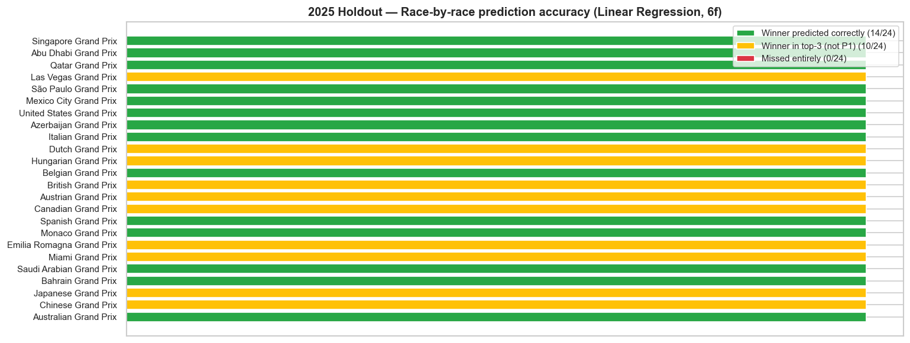
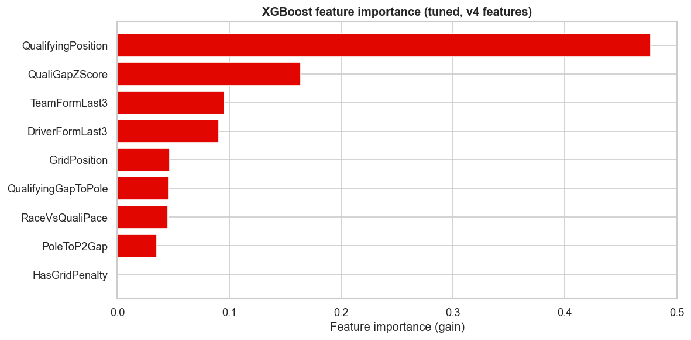

# F1 Race Winner Predictor

A machine learning project predicting Formula 1 race outcomes from qualifying performance, recent form, and circuit characteristics. Trained on 2022-2024 seasons, validated on the 2025 season as a true holdout, and deployed as an interactive dashboard.

> **Status:** Phases 1, 2 & 3 complete — validated model, live interactive dashboard, and head-to-head model benchmarks. **[▶ Try the live dashboard](https://f1-race-predictor-orp.streamlit.app/)**. See [Roadmap](#roadmap) for the full picture.

## Headline result

The final 6-feature linear regression was trained on 2022-2024 and tested on 24 races of 2025 — a season the model never saw during development.

| Metric | Pole baseline | Linear Regression (final) |
|---|---|---|
| RMSE | 4.69 | **4.22** |
| Top-1 accuracy | 66.7% | 58.3% |
| Top-3 accuracy | 95.8% | **100%** (24/24 races) |

The model produces calibrated finish-position estimates for every driver, with 100% top-3 accuracy on the holdout — every 2025 race winner appeared in our top-3 predictions. The pole baseline beats us on top-1 prediction (a season-specific quirk: 2025 had unusually high pole-to-win conversion), but we provide ranked predictions for the entire field, not just the winner.



## Live demo

**[▶ Try the dashboard](https://f1-race-predictor-orp.streamlit.app/)** — select any race from 2022–2025 and see predicted vs actual podiums, full-grid predictions with confidence indicators, and biggest-climber callouts, rendered in F1 broadcast styling with team colours.

## Key findings from multi-season EDA (2022-2024)

### Verstappen dominated all three seasons; margins varied wildly


Verstappen won every championship in the dataset, but the margin to second place collapsed from 270 points (2023) to 55 points (2024) — the largest year-on-year compression in modern F1.

### Constructor balance reset between 2023 and 2024


Red Bull's win rate fell from 95.5% in 2023 to 37.5% in 2024 — a ~60 percentage point swing. McLaren went from zero wins to 25%, the steepest single-season rise in the dataset.

### Qualifying predictiveness rose, then broke trend in 2025


| Season | Grid → Finish Correlation | N |
|--------|---------------------------|---|
| 2022   | 0.525 | 429 |
| 2023   | 0.581 | 437 |
| 2024   | 0.736 | 458 |
| 2025   | 0.651 | 479 |

Grid → finish correlation rose steadily through the 2022 regulation cycle as cars converged, peaking in 2024. The 2025 figure broke the trend — qualifying became *less* predictive of race outcomes than in 2024. The likely driver is increased mid-season car development volatility ahead of the 2026 regulation reset, though small-sample noise can't be ruled out.

**Implication for modelling**: a model cannot assume grid-to-finish stationarity across seasons. This is exactly why the 2025 holdout matters — it's the cleanest possible test of whether features generalise across regimes, not just within a single trend.

## Modelling approach

### Problem framing

Reformulated "predict the winner" as **regression on finish position**. For each driver-race row, predict the finish position; pick the lowest predicted as winner. Advantages over binary classification: every row carries a label, no class imbalance issues, and the same model gives podium predictions for free.

### Feature engineering

Six features, each leak-free (rolling features use `.shift(1)` to prevent target leakage):

| Feature | Description |
|---|---|
| `GridPosition` | Starting position (post-penalty) |
| `QualifyingPosition` | Qualifying result |
| `QualifyingGapToPole` | Time gap to pole-sitter (capped at 10s) |
| `DriverFormLast3` | Rolling average finish position over driver's last 3 races |
| `TeamFormLast3` | Rolling average finish position for team over last 3 races |
| `IsStreetCircuit` | Binary flag for street circuits |

Three additional feature iterations (driver-circuit history, team momentum slope, qualifying gap z-score, pole-to-P2 gap, race-vs-quali pace, grid penalty indicator) were tested and dropped after diagnostics showed redundancy with the core feature set.

### Train/test methodology

Strict temporal splits — never random:

- **Initial selection**: train 2022-2023, test 2024
- **Final validation**: train 2022-2024, test 2025 (true holdout, never used during model selection)
- **Hyperparameter tuning**: TimeSeriesSplit cross-validation within training data

### Models compared

Pole baseline, form baseline, linear regression, XGBoost (default), XGBoost (tuned via 81-combination GridSearchCV).



The 6-feature linear regression was selected as the final model — best generalisation, fewest hyperparameters to defend, most interpretable coefficients. XGBoost showed mild overfitting that tuning didn't fully resolve.

## Tech stack

- **Python 3.9**
- **Data**: `fastf1` (primary), Jolpica API (Ergast replacement fallback)
- **Analysis**: `pandas`, `numpy`, `matplotlib`, `seaborn`
- **Modelling**: `scikit-learn 1.6`, `xgboost 2.1`
- **Deployment**: - Streamlit Community Cloud — [live dashboard](https://f1-race-predictor-orp.streamlit.app/)

## Project structure

```
f1-race-predictor/
├── app.py                                # Streamlit dashboard (entry point)
├── cache/                                # fastf1 local cache (gitignored)
├── data/
│   ├── raw/                              # raw season results (gitignored)
│   └── processed/
│       └── features_2022_2025.csv        # engineered feature dataset
├── notebooks/
│   ├── 01_eda_2024_season.ipynb          # single-season exploration
│   ├── 02_multi_season_eda.ipynb         # 2022–2024 comparative analysis
│   ├── 03_feature_analysis.ipynb         # feature engineering + diagnostics
│   ├── 04_baseline_models.ipynb          # baselines + initial model selection
│   ├── 05_validation_2025.ipynb          # final holdout validation (linear regression)
│   └── 06_model_comparison.ipynb         # head-to-head: LR vs RF vs XGBoost on 2025
├── src/
│   ├── load_season.py                    # season data loader (fastf1 + Jolpica)
│   ├── features.py                       # feature engineering module
│   ├── predict.py                        # training + per-race prediction logic
│   └── team_colors.py                    # F1 team colour mapping for the UI
├── requirements.txt
└── README.md
```


## Setup

```bash
git clone https://github.com/Om-Ravindra-Patil/F1-Race-Predictor.git
cd F1-Race-Predictor
python3 -m venv venv
source venv/bin/activate
pip install -r requirements.txt
```

## Usage

Load race + qualifying data for one or more seasons:

```bash
# Default: loads 2022-2025
python3 src/load_season.py

# Specific seasons
python3 src/load_season.py 2022 2023
```

Build feature dataset:

```bash
python3 src/features.py
# Saves to data/processed/features_2022_2025.csv
```

Run notebooks in order (`01` → `05`) to reproduce the full analysis.

## What this project demonstrates

- **End-to-end ML pipeline**: raw data → cleaning → feature engineering → temporal validation → deployment
- **Honest negative results**: documented two failed feature engineering iterations alongside the successful approach
- **True holdout validation**: model selected on 2024 was tested on 2025 (genuinely unseen) — the strongest possible generalisation test
- **Production-quality engineering**: defensive data loading with API fallback, leak-free rolling features, reusable evaluation framework, time-series-aware cross-validation
- **Clear analytical writing**: every modelling decision documented with reasoning, including non-obvious findings (e.g. season-level non-stationarity affecting cross-validation strategy)


### Phase 1: Validated model (complete)
- Multi-season data pipeline (2022–2025)
- Feature engineering with leak prevention
- Baseline + tuned ML models (Linear Regression, XGBoost)
- True holdout validation on 2025 — 100% top-3 accuracy

### Phase 2: Interactive dashboard (complete)
- Streamlit dashboard with race-by-race predictions and team-coloured visualisations
- Live deployment → [f1-race-predictor-orp.streamlit.app](https://f1-race-predictor-orp.streamlit.app/)
- Per-race view: predicted vs actual podium, full-grid predictions with confidence indicators, biggest-climber callouts

### Phase 3: Model expansion (complete)
- Random Forest and tuned XGBoost benchmarked head-to-head against linear regression on the 2025 holdout
- Train-test gap diagnostic confirms tree-based ensembles overfit (gaps of +0.247 and +0.270) while linear regression generalises (gap of +0.014)
- 6-feature linear regression confirmed as the right production choice

### Phase 4: Engineering polish (planned)
- Unit test coverage for feature engineering pipeline
- Race telemetry features via fastf1 lap data (future)
- Live predictions for upcoming 2026 race weekends (future)

## Author

**Om Patil** — MSc Data Science, Newcastle University (graduating September 2026). Open to UK Data Science / Data Analyst roles. Holds Graduate Visa (no sponsorship required).

[LinkedIn](https://www.linkedin.com/in/om-patil-nu) · [GitHub](https://github.com/Om-Ravindra-Patil)