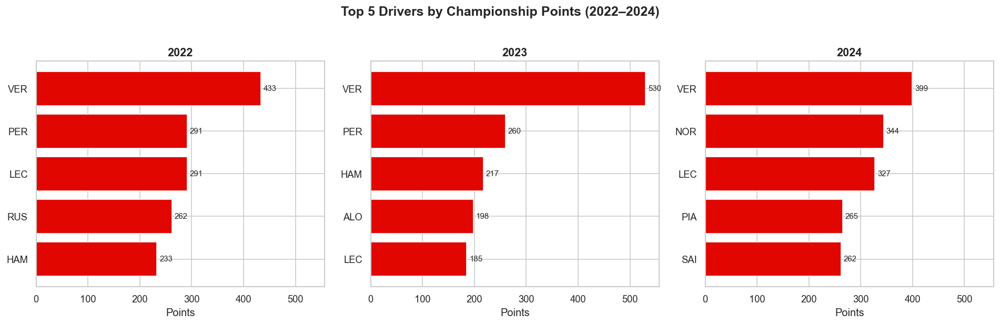
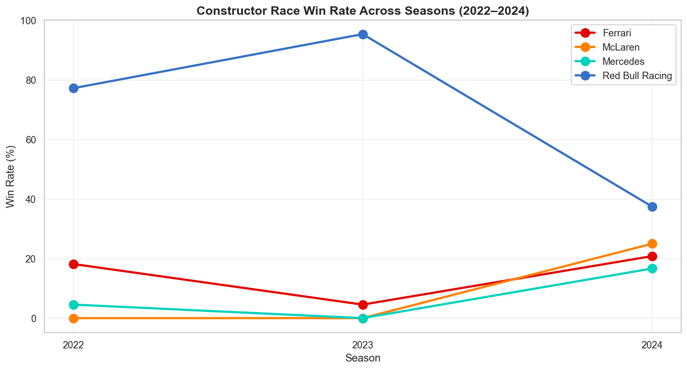
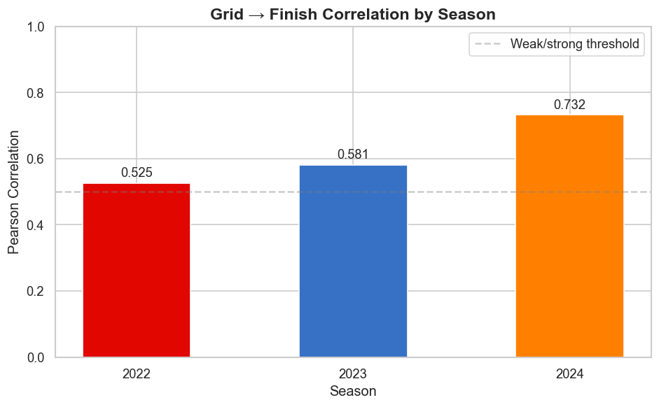

# F1 Race Winner Predictor

A machine learning project to predict Formula 1 race winners using race results, qualifying performance, and historical patterns. Built as a portfolio project for the 2024 season, with a planned Streamlit dashboard for live predictions.

## Project Status

**In active development** — currently in the data exploration phase.

- Data pipeline: 2024 season race results loaded via `fastf1` (479 rows, 24 races, 24 drivers)
- Exploratory data analysis on driver, constructor, and grid position patterns
- Feature engineering (qualifying, recent form, circuit characteristics)
- Model training (logistic regression baseline → XGBoost)
- Streamlit dashboard for race-by-race predictions

## Key Findings (2022–2024 EDA)

### Driver dominance shifts dramatically between seasons


Verstappen led every season but the gap to second varied enormously: 142 points (2022) → **270 points (2023, the largest in F1 history)** → just 55 points (2024). The 2024 grid is the closest at the top in three seasons.

### Constructor balance reset between 2023 and 2024


Red Bull's win rate collapsed from **95.5% in 2023 to 37.5% in 2024**, while McLaren went from zero wins to a 25% win rate — the steepest single-season swing in modern F1.

### Grid position became more predictive each year


| Season | Grid → Finish Correlation |
|--------|---------------------------|
| 2022   | 0.525 |
| 2023   | 0.581 |
| 2024   | 0.732 |

This monotonic increase suggests qualifying performance has become a stronger predictor of race outcomes as cars converged after the 2022 regulation reset.

**Implication for modelling**: this non-stationarity matters. A model trained only on the most predictable season (2024) would overestimate its accuracy when applied to more chaotic regulation eras. Cross-validation strategy needs to account for season-level shifts in baseline predictability.

## Tech Stack

- **Python 3.9+**
- **Data:** `fastf1` (primary), Jolpica API (historical fallback), OpenF1 (live data)
- **Analysis:** `pandas`, `numpy`, `matplotlib`, `seaborn`
- **Modelling:** `scikit-learn`, `XGBoost` (planned)
- **Deployment:** Streamlit (planned)

## Setup

```bash
git clone https://github.com/Om-Ravindra-Patil/f1-race-predictor.git
cd f1-race-predictor
python3 -m venv venv
source venv/bin/activate
pip install -r requirements.txt
```

## Usage

Load race results for one or more seasons:

```bash
# Single season (default: 2024)
python3 src/load_season.py

# Multiple seasons
python3 src/load_season.py 2022 2023 2024
```

Run the EDA notebooks:

```bash
# 2024 season analysis
jupyter notebook notebooks/01_eda_2024_season.ipynb

# 2022–2024 multi-season comparative analysis
jupyter notebook notebooks/02_multi_season_eda.ipynb
```

## Author

**Om Patil** — MSc Data Science, Newcastle University (graduating Sep 2026)

[LinkedIn](#) · [GitHub](https://github.com/Om-Ravindra-Patil)
