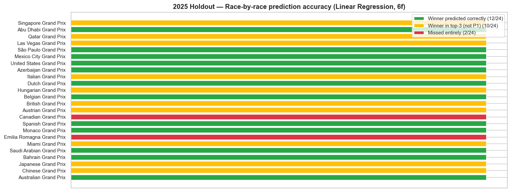
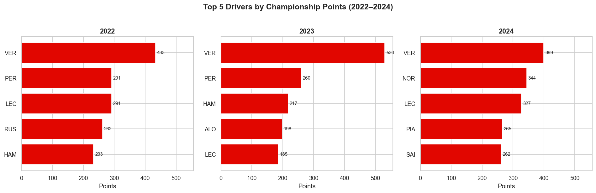
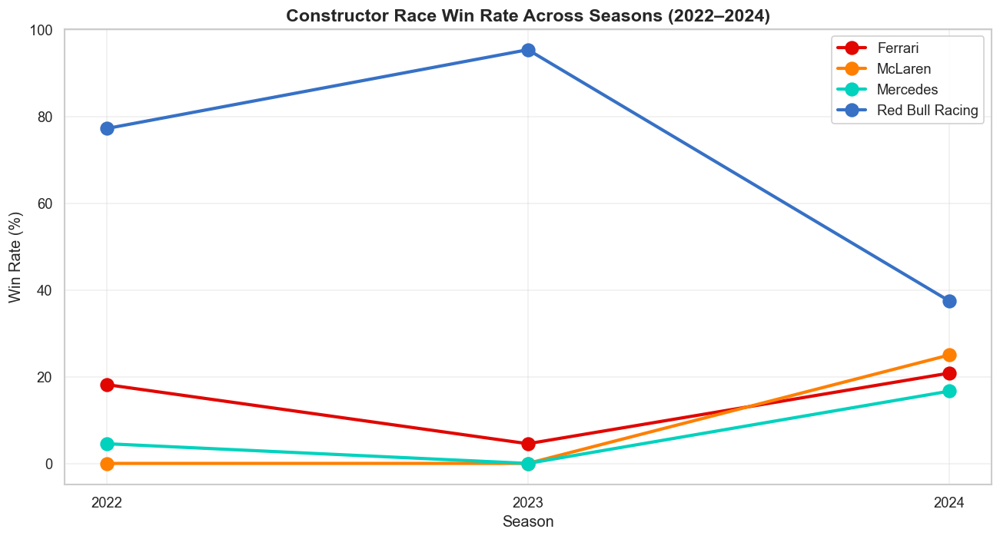
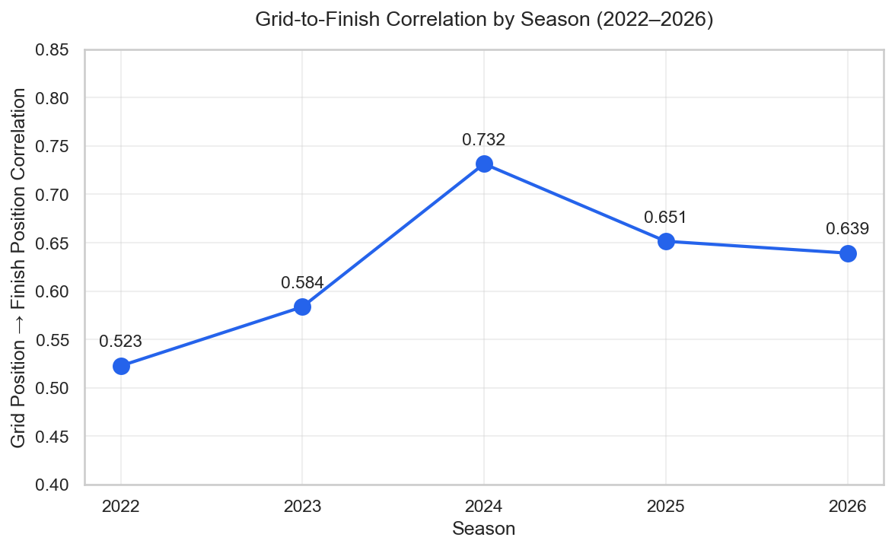
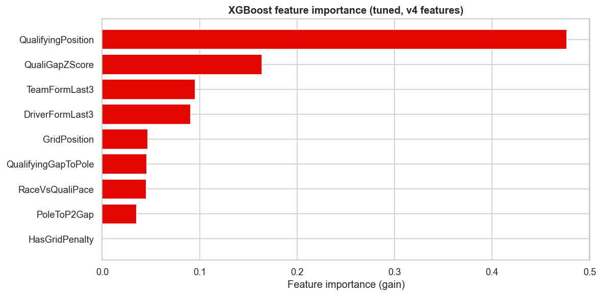

# F1 Race Winner Predictor

A machine learning project predicting Formula 1 race outcomes from qualifying performance, recent form, and circuit characteristics. Trained on 2022-2024 seasons, validated on the 2025 season as a true holdout, and deployed as an interactive dashboard.

> **Status:** Phases 1–4 complete — validated model, live dashboard, head-to-head model benchmarks, and live predictions for 2026 race weekends. **[▶ Try the live dashboard](https://f1-race-predictor-orp.streamlit.app/)**. See [Roadmap](#roadmap) for the full picture.

## Headline result

The final 6-feature linear regression was trained on 2022-2024 and tested on 24 races of 2025 — a season the model never saw during development.

| Metric | Pole baseline | Linear Regression (final) |
|---|---|---|
| RMSE | 4.69 | **4.25** |
| Top-1 accuracy | 66.7% | 50.0% |
| Top-3 accuracy | 95.8% | 91.7% (22/24 races) |

The model beats the pole baseline by **0.44 positions of RMSE** — it predicts the whole field's finishing order substantially better, and puts the eventual winner in its top 3 in 22 of 24 races. The pole baseline is better at naming the exact winner (2025 had unusually high pole-to-win conversion), but it says nothing about the other 19 drivers; the model ranks the entire grid.

> **Correction (Sept 2026):** earlier versions of this README reported 100% top-3 accuracy. That figure was inflated by a leak in `TeamFormLast3`: team form was computed over the team's previous *rows*, and with two cars per race the second driver's feature included their teammate's result from the same race. Team form is now aggregated per race before the rolling window, a regression test guards it, and all numbers above are from the corrected pipeline.



### Surviving the 2026 regulation reset

2026 brought new chassis and power-unit rules, a 22-car grid (Cadillac) and Audi replacing Sauber. The model — trained only on the 2022–2025 era — was tested on every 2026 race run so far ([notebook 07](notebooks/07_validation_2026.ipynb)):

| 2026, rounds 1–15 | Pole baseline | Linear Regression |
|---|---|---|
| RMSE | 5.18 | **4.79** |
| Top-1 accuracy | 66.7% | 66.7% |
| Top-3 accuracy | 93.3% | 86.7% |

The RMSE advantage over the pole baseline (+0.38 positions) is almost unchanged from the 2025 holdout (+0.44): qualifying and form features don't depend on the rulebook. Absolute errors rise for both, as expected with a bigger grid and new cars.

## Live demo

**[▶ Try the dashboard](https://f1-race-predictor-orp.streamlit.app/)** — select any race from 2023–2026 and see predicted vs actual podiums, or the live prediction for the next 2026 race once qualifying is done, full-grid predictions with each driver's chance to win and reach the podium (from 10,000 simulated races, calibrated on past seasons — [notebook 08](notebooks/08_win_probability_calibration.ipynb)), a per-driver breakdown of *why* the model predicts each position (exact for a linear model: qualifying, driver form and team form add up to the prediction), a race-story chart tracing every driver from qualifying to predicted finish to result, and biggest-climber callouts, rendered in F1 broadcast styling with team colours. Every race has a shareable link, e.g. [`?season=2026&round=15`](https://f1-race-predictor-orp.streamlit.app/?season=2026&round=15).

## Key findings from multi-season EDA (2022-2024)

### Verstappen dominated all three seasons; margins varied wildly



Verstappen won every championship in the dataset, but the margin to second place collapsed from 270 points (2023) to 55 points (2024) — the largest year-on-year compression in modern F1.

### Constructor balance reset between 2023 and 2024



Red Bull's win rate fell from 95.5% in 2023 to 37.5% in 2024 — a ~60 percentage point swing. McLaren went from zero wins to 25%, the steepest single-season rise in the dataset.

### Qualifying predictiveness rose, then broke trend in 2025



| Season | Grid → Finish Correlation | N |
|--------|---------------------------|---|
| 2022   | 0.523 | 439 |
| 2023   | 0.584 | 439 |
| 2024   | 0.732 | 479 |
| 2025   | 0.651 | 479 |
| 2026*  | 0.639 | 330 |

\*2026 season in progress (rounds 1–15), new regulations.

Grid → finish correlation rose steadily through the 2022 regulation cycle as cars converged, peaking in 2024. The 2025 figure broke the trend — qualifying became *less* predictive of race outcomes than in 2024. The likely driver is increased mid-season car development volatility ahead of the 2026 regulation reset, though small-sample noise can't be ruled out.

**Implication for modelling**: a model cannot assume grid-to-finish stationarity across seasons. This is exactly why the 2025 holdout matters — it's the cleanest possible test of whether features generalise across regimes, not just within a single trend.

## Modelling approach

### Problem framing

Reformulated "predict the winner" as **regression on finish position**. For each driver-race row, predict the finish position; pick the lowest predicted as winner. Advantages over binary classification: every row carries a label, no class imbalance issues, and the same model gives podium predictions for free.

**Retirements are kept, not dropped.** A driver who retires keeps their official classified position (usually at the back of the field), so the model learns that a DNF is a bad result — which is how it should read for anyone using the predictions. Only non-starters, who have no finish position, are excluded.

### Feature engineering

Six features, each leak-free (rolling features use `.shift(1)` to prevent target leakage):

| Feature | Description |
|---|---|
| `GridPosition` | Starting position (post-penalty) |
| `QualifyingPosition` | Qualifying result |
| `QualifyingGapToPole` | Time gap to pole-sitter (capped at 10s) |
| `DriverFormLast3` | Rolling average finish position over driver's last 3 races |
| `TeamFormLast3` | Team's average finish position over its last 3 races (per-race team mean, so teammates never see each other's current result) |
| `IsStreetCircuit` | Binary flag for street circuits |

Three additional feature iterations (driver-circuit history, team momentum slope, qualifying gap z-score, pole-to-P2 gap, race-vs-quali pace, grid penalty indicator) were tested and dropped after diagnostics showed redundancy with the core feature set.

A driver DNF-rate feature was originally dismissed as uninformative, but that was a bug: it counted rows with no finish position, and retirements keep their classified position, so the rate was almost always 0. Fixed (Sept 2026) to use the official classification and retested as a 7th feature: a small gain on 2024/2025 but worse on 2026 (top-1 66.7% → 46.7%), with a counter-intuitive sign — not adopted.

### Train/test methodology

Strict temporal splits — never random:

- **Initial selection**: train 2022-2023, test 2024
- **Final validation**: train 2022-2024, test 2025 (true holdout, never used during model selection)
- **Hyperparameter tuning**: TimeSeriesSplit cross-validation within training data

### Models compared

Pole baseline, form baseline, linear regression, XGBoost (default), XGBoost (tuned via 81-combination GridSearchCV).



The 6-feature linear regression was selected as the final model — best generalisation, fewest hyperparameters to defend, most interpretable coefficients. XGBoost showed mild overfitting that tuning didn't fully resolve.

## Tech stack

- **Python 3.9**
- **Data**: `fastf1` (primary), Jolpica API (Ergast replacement fallback)
- **Analysis**: `pandas`, `numpy`, `matplotlib`, `seaborn`
- **Modelling**: `scikit-learn 1.6`, `xgboost 2.1`
- **Deployment**: - Streamlit Community Cloud — [live dashboard](https://f1-race-predictor-orp.streamlit.app/)

## Project structure

```
f1-race-predictor/
├── .github/workflows/update-data.yml     # scheduled 2026 data refresh
├── app.py                                # Streamlit dashboard (entry point)
├── cache/                                # fastf1 local cache (gitignored)
├── data/
│   ├── raw/                              # raw race + qualifying results per season
│   └── processed/
│       └── features.csv        # engineered feature dataset
├── notebooks/
│   ├── 01_eda_2024_season.ipynb          # single-season exploration
│   ├── 02_multi_season_eda.ipynb         # 2022–2024 comparative analysis
│   ├── 03_feature_analysis.ipynb         # feature engineering + diagnostics
│   ├── 04_baseline_models.ipynb          # baselines + initial model selection
│   ├── 05_validation_2025.ipynb          # final holdout validation (linear regression)
│   ├── 06_model_comparison.ipynb         # head-to-head: LR vs RF vs XGBoost on 2025
│   ├── 07_validation_2026.ipynb          # 2026 season test across the regulation reset
│   └── 08_win_probability_calibration.ipynb  # are the simulated win/podium chances honest?
├── src/
│   ├── load_season.py                    # season data loader (fastf1 + Jolpica)
│   ├── features.py                       # feature engineering module
│   ├── predict.py                        # training + per-race prediction logic
│   ├── circuits.py                       # track outlines from fastf1 position data
│   └── team_colors.py                    # F1 team colour mapping for the UI
├── tests/test_features.py                # pytest suite: features, data integrity, predictions
├── requirements.txt
└── README.md
```


## Setup

```bash
git clone https://github.com/Om-Ravindra-Patil/F1-Race-Predictor.git
cd F1-Race-Predictor
python3 -m venv venv
source venv/bin/activate
pip install -r requirements.txt
```

## Usage

Load race + qualifying data for one or more seasons:

```bash
# Default: loads 2022-2026
python3 src/load_season.py

# Specific seasons
python3 src/load_season.py 2022 2023
```

The loader only fetches rounds that aren't already saved, so finished rounds never change. Delete a season's CSV in `data/raw/` to re-fetch it from scratch.

Build feature dataset:

```bash
python3 src/features.py
# Saves to data/processed/features.csv
```

Track outlines for the dashboard (run locally; only fetches circuits not yet saved in `data/circuits.json`):

```bash
python3 src/circuits.py
```

Run notebooks in order (`01` → `08`) to reproduce the full analysis.

Run the tests (install `pytest` in your venv first — it isn't in `requirements.txt` because the deployed app doesn't need it):

```bash
pytest
```

### Live data updates (automated)

A [GitHub Action](.github/workflows/update-data.yml) checks for new 2026 data every 6 hours from Friday to Monday. When qualifying or a race result lands, it rebuilds the features, runs the tests and pushes — Streamlit Cloud redeploys, so the dashboard shows the next race's prediction after qualifying and the result after the race. It can also be run by hand from the repo's **Actions** tab (**Run workflow**).

Because the Action commits to `main`, run `git pull` before working locally. To update by hand instead:

```bash
python3 src/load_season.py 2026 && python3 src/features.py && pytest && git add -A && git commit -m "2026 data update" && git push
```

## What this project demonstrates

- **End-to-end ML pipeline**: raw data → cleaning → feature engineering → temporal validation → deployment
- **Honest negative results**: documented two failed feature engineering iterations alongside the successful approach
- **True holdout validation**: model selected on 2024 was tested on 2025 (genuinely unseen) — the strongest possible generalisation test
- **Production-quality engineering**: defensive data loading with API fallback, leak-free rolling features, reusable evaluation framework, time-series-aware cross-validation
- **Clear analytical writing**: every modelling decision documented with reasoning, including non-obvious findings (e.g. season-level non-stationarity affecting cross-validation strategy)


### Phase 1: Validated model (complete)
- Multi-season data pipeline (2022–2026)
- Feature engineering with leak prevention
- Baseline + tuned ML models (Linear Regression, XGBoost)
- True holdout validation on 2025 — beats the pole baseline on RMSE (4.25 vs 4.69), winner in top 3 in 22/24 races

### Phase 2: Interactive dashboard (complete)
- Streamlit dashboard with race-by-race predictions and team-coloured visualisations
- Live deployment → [f1-race-predictor-orp.streamlit.app](https://f1-race-predictor-orp.streamlit.app/)
- Per-race view: predicted vs actual podium, full-grid predictions with win/podium chances, biggest-climber callouts

### Phase 3: Model expansion (complete)
- Random Forest and tuned XGBoost benchmarked head-to-head against linear regression on the 2025 holdout
- Random Forest roughly ties linear regression on 2025 RMSE (4.24 vs 4.25) but overfits: train–test gaps of +0.265 (RF) and +0.262 (XGBoost) against +0.043 for linear regression, with lower top-3 accuracy (87.5% vs 91.7%)
- 6-feature linear regression confirmed as the right production choice

### Phase 4: Engineering polish + live 2026 predictions (complete)
- pytest suite covering feature engineering, data integrity and predictions; found and fixed a teammate leak in `TeamFormLast3`
- Model tested on the 2026 season across the regulation reset — RMSE advantage over the pole baseline holds
- Live predictions for upcoming 2026 races, built from qualifying before the race is run; debut drivers and new teams get estimated form (marked in the UI)

- Scheduled GitHub Action keeps 2026 data and predictions current without manual steps

### Next
- Race telemetry features via fastf1 lap data

## Author

**Om Patil** — MSc Data Science, Newcastle University (graduating September 2026). Open to UK Data Science / Data Analyst roles. Holds Graduate Visa (no sponsorship required).

[LinkedIn](https://www.linkedin.com/in/om-patil-nu) · [GitHub](https://github.com/Om-Ravindra-Patil)